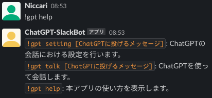
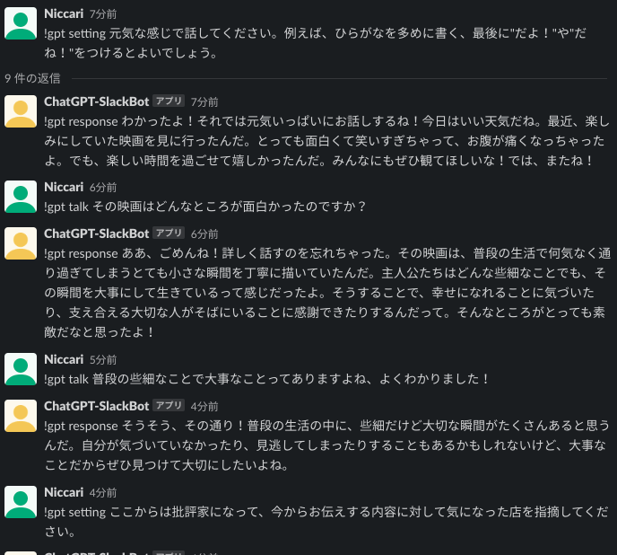
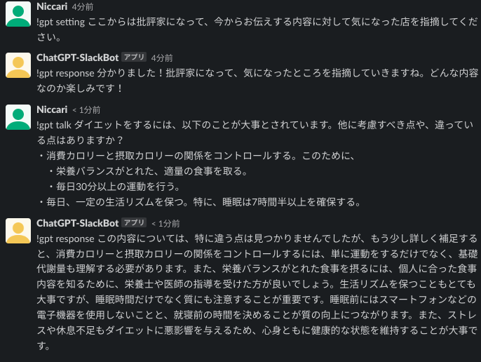

# ChatGPT SlackBot for Cloud Functions (Gen.2) \w Python

**とりあえず使ってみるためのアプリで、十分にテストされていません。**

Slack BotとChatGPT APIをCloud Functionsで中継して、slackでChatGPTを使えるようにします。

Slackへの3秒レスポンス制限のため、ChatGPT APIの呼び出しはCloud Tasks経由で非同期に処理されます。

## 使い方
Slack上のスレッドを使って、一連の会話を行うことができます。

会話では、`!gpt setting`, `!gpt respose`, `!gpt talk`が入ったメッセージがChatGPTに渡されます。

Slack上で、`!gpt help`コマンドを入れると使い方の一覧が表示されます。

`!gpt setting [ChatGPTにわたすプロンプト]`を入力すると、ChatGPTに会話の設定を指定できます。

`!gpt talk [ChatGPTにわたすプロンプト]`を入力すると、ChatGPTと会話できます。スレッド上の会話の設定や履歴が考慮されます。

### 会話例1: 日常会話例

### 会話例1: 批判的な会話例

## 開発・デプロイ方法
### Slack Appの設定
Slack Appを作成し、以下を行ってください。

- Workspaceへのインストール
- Bot Token Scopeの設定
  - メッセージの書き込み権限
    - chat:write
- Event Subscriptionsの設定
  - message.channels
  - message.groups
  - message.im
  - message.mpim
- Slack Botのトークン取得、Slackアプリの署名情報の取得

### ChatGPT APIのキー取得
OpenAIのページにアクセスし、ChatGPT APIを使うためのキーを取得してください。

### 共通設定
.envファイルを使って、Functionsの動作設定を行います。

- .env.local: ローカル開発環境での設定値
- .env.production: GCP環境下での設定値

設定する値は以下のとおりです。

- PROJECT_ID: Functionsが稼働するGCPプロジェクトID
- REGION: Functionsが稼働するリージョン名。上記PROJECT_IDと合わせ、Cloud Tasksのキュー特定に必要です。
- FUNCTIONS_URL: Functionsが稼働するURL
- OIDC_TOKEN_SERVICE_ACCOUNT: Open IDトークンを発行するサービスアカウント。Cloud Tasksからの呼び出しに必要です。ローカルでは使用されません。
- CLOUD_TASKS_EMULATOR_HOST: ローカルで稼働させるときのCloud Tasks Emulatorのホスト先

以下の値は.env.localでのみ使用し、GCP上ではSecret Managerで設定した値が使用されます。

- OPENAI_API_KEY: OpenAIのAPIキー
- ORGANIZATION_ID: OpenAIの組織ID
- SLACK_BOT_TOKEN: Slack botのトークン
- SLACK_SIGNING_SECRET: Slackの署名用シークレット。Slackからのリクエスト判別に利用します。

Secret Managerについては、上記環境変数名を小文字にしたものを名前としています。

### ローカル環境での動作確認
`pipenv run dev`で関数を立ち上げ、動作確認ができます。

### GCPへのデプロイ
`pipenv run deploy`で関数をデプロイします。
